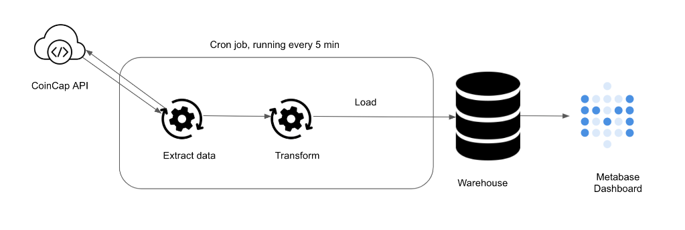

# Bitcoin-Monitor

This Project aims to create a simple dashboard that is populated by near real-time bitcoin exchange data.


## Archiecture


## Setup

### Clone the code as shown below.
```
git clone https://github.com/ShrithikShahapure/Bitcoin-Monitor.git
cd Bitcoin-Monitor
```

### Local run & test.
```
make up # start the docker containers on your computer & runs migrations under ./migrations
make ci # Runs auto formatting, lint checks, & all the test files under ./tests
```

### Create AWS services with Terraform
```
make tf-init # Only needed on your first terraform run (or if you add new providers)
make infra-up # type in yes after verifying the changes TF will make
```

### Wait until the EC2 instance is initialized, you can check this via your AWS UI
```
make cloud-metabase # this command will forward Metabase port from EC2 to your machine and opens it in the browser
```
